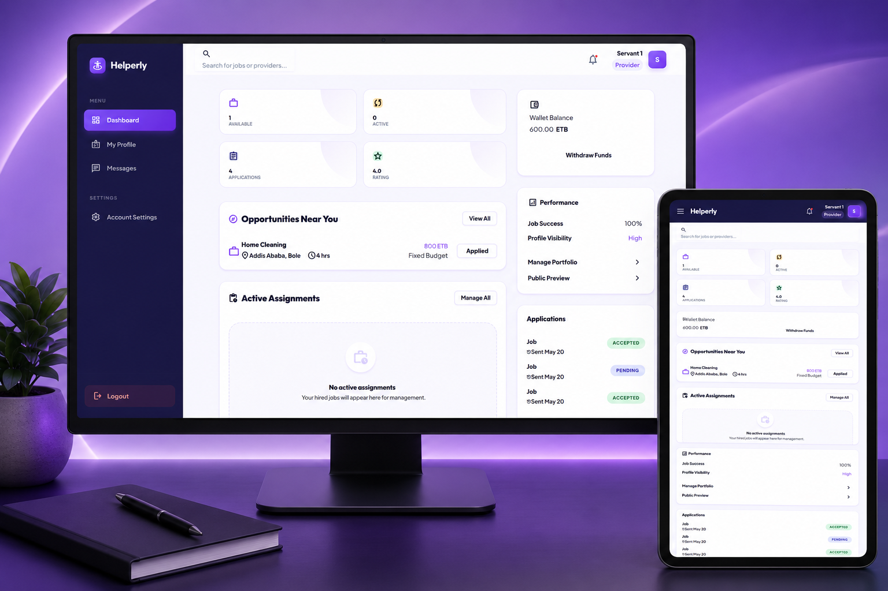
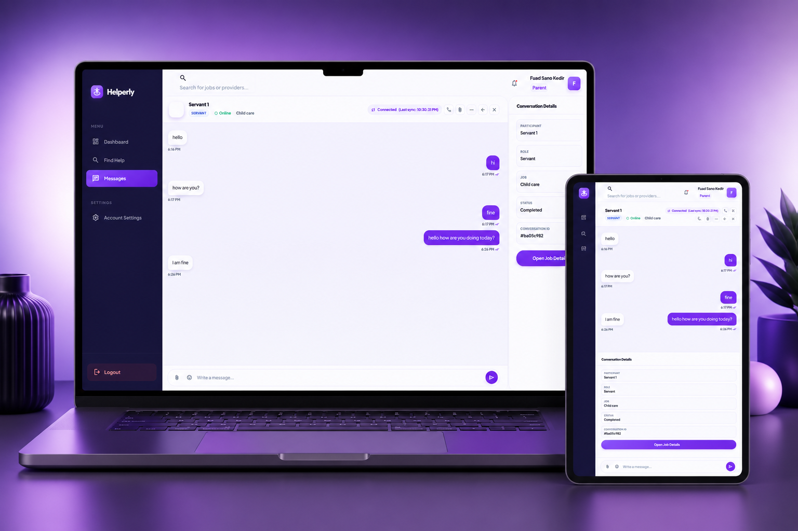

# Helperly

Helperly is a premium home-service marketplace that connects parents with verified service providers. The app is built with vanilla PHP, MongoDB, and a polished purple-first design system that supports booking, hiring, messaging, payments, reviews, and admin moderation.

## Project Overview

Helperly serves two primary workflows:

- Parents can find trusted providers, post jobs, pay for work, and leave ratings.
- Servants/providers can build profiles, get verified, apply to jobs, chat with parents, and track earnings.

The codebase is intentionally server-rendered and route-driven, so it remains compatible with the existing architecture while still feeling modern and production-ready.

## Tech Stack

- PHP 8.1+
- MongoDB
- Vanilla JavaScript
- HTML5
- CSS3
- Composer autoloading
- PHPMailer
- ImageKit
- Docker and Docker Compose
- Nginx

## Features

### Authentication

Session-based login and registration with CSRF protection, password reset, and role-aware routing.

### Messaging

Job-based conversation threads with polling-backed updates and notification support.

### Hiring System

Parents can post jobs, book providers directly, review applicants, accept or reject applications, and confirm completion.

### Provider Profiles

Providers manage identity, skills, availability, rates, verification documents, and public reviews.

### Dashboard

Each role gets its own dashboard: parents, providers, and administrators all see workflows tailored to their responsibilities.

### Reviews

Parents can rate providers and leave feedback after a completed job. Review summaries are shown on provider profiles.

### Notifications

The platform sends notifications for job assignments, applications, confirmations, payments, and reviews.

### Real-Time Chat

Chat remains compatible with the current polling-based implementation and existing endpoints.

### Booking Functionality

Parents can directly book providers or let providers apply to posted jobs.

## Existing Folder Structure

The current architecture is preserved exactly as-is:

- `assets/` - CSS and JavaScript assets
- `bin/` - CLI setup utilities
- `config/` - app bootstrap, helpers, and database config
- `controllers/` - request handlers and business logic
- `core/` - router and framework primitives
- `models/` - MongoDB data-access classes
- `public/` - front controller and web root entry point
- `scratch/` - maintenance and debug utilities
- `views/` - server-rendered PHP templates
- `vendor/` - Composer dependencies

## Installation

### 1. Clone the repository

```bash
git clone https://github.com/mroxygen2024/Helperly.git
cd Helperly
```

### 2. Install dependencies

```bash
composer install
```

### 3. Configure environment variables

Create your environment file and configure the values expected by the app:

```bash
cp .env.example .env
```

If your project uses a different environment setup, keep the variable names referenced in `config/app.php` and `config/database.php`.

### 4. Initialize the app

```bash
php bin/setup.php
```

### 5. Run locally

```bash
php -S localhost:8000 -t public public/index.php
```

### 6. Run with Docker

```bash
docker compose up --build
```

## Environment Variables

Common environment variables used by the current app include:

- `APP_NAME` - displayed platform name
- `APP_URL` - public base URL
- `APP_DEBUG` - enables or disables debug output
- `MONGODB_URI` - MongoDB connection string
- `MONGODB_DB` - MongoDB database name
- `JWT_SECRET` - JWT signing secret
- `IMAGEKIT_PUBLIC_KEY` - ImageKit public key
- `IMAGEKIT_PRIVATE_KEY` - ImageKit private key
- `IMAGEKIT_URL_ENDPOINT` - ImageKit URL endpoint
- `MAIL_HOST` - SMTP host
- `MAIL_PORT` - SMTP port
- `MAIL_USERNAME` - SMTP username
- `MAIL_PASSWORD` - SMTP password
- `MAIL_FROM_ADDRESS` - sender address
- `MAIL_FROM_NAME` - sender name

## Scripts

The project does not currently define package-manager scripts, so the supported commands are direct runtime commands:

- `dev` - `php -S localhost:8000 -t public public/index.php`
- `build` - `docker compose build`
- `start` - `docker compose up`
- `lint` - `php -l <file>`
- `test` - no formal automated test runner is configured yet

## API Information

Important application routes:

### Authentication

- `POST /login`
- `POST /register`
- `GET /forgot-password`
- `POST /forgot-password`
- `GET /reset-password`
- `POST /reset-password`
- `POST /logout`

### Profiles and Services

- `GET /profile/servant`
- `POST /profile/servant`
- `GET /profile/employer`
- `POST /profile/employer`
- `GET /profile/account`
- `POST /profile/account`
- `GET /services`
- `POST /services`

### Jobs and Hiring

- `GET /job/book`
- `POST /jobs`
- `GET /jobs/apply`
- `POST /jobs/apply`
- `POST /jobs/accept`
- `POST /jobs/reject`
- `POST /jobs/confirm`
- `GET /jobs/detail`
- `GET /jobs/available`

### Messaging, Payments, and Reviews

- `GET /messages`
- `POST /messages`
- `GET /api/messages`
- `POST /payments/pay`
- `POST /reviews`

### Public Profiles

- `GET /provider/view.php`
- `GET /parent/view.php`

### Role Dashboards

- `GET /parent/jobs`
- `GET /parent/payments`
- `GET /parent/providers`
- `GET /provider/jobs`
- `GET /provider/applications`
- `GET /provider/payments`

### Admin

- `GET /admin/verifications`
- `POST /admin/servant-verification`
- `GET /admin/users`
- `GET /admin/users/detail`
- `POST /admin/users/toggle-block`
- `POST /admin/users/delete`
- `GET /admin/jobs`
- `GET /admin/jobs/detail`
- `GET /admin/providers`
- `GET /admin/providers/detail`

## 🖥️ UI Preview

The mockups below highlight the current visual direction of Helperly. They are organized by workflow so the showcase feels closer to a product portfolio than a plain asset dump.

### Provider Dashboard



*Provider dashboard view showing profile status, job activity, and marketplace controls.*

### Messaging and Job Coordination



*Messaging-focused dashboard view for active conversations, job updates, and parent-provider coordination.*

## Deployment

For deployment, make sure to:

1. Install Composer dependencies.
2. Set production environment variables.
3. Point the web server document root to `public/`.
4. Verify MongoDB connectivity and required indexes.
5. Disable `APP_DEBUG` in production.
6. Confirm upload permissions for verification and profile media.

For Docker-based deployments, build the image and run the compose stack with production environment values.

## Contribution Guide

1. Fork the repository.
2. Create a feature branch.
3. Make focused incremental commits.
4. Keep changes inside the current architecture and folder structure.
5. Open a pull request with a clear summary and validation notes.

## Code Standards

- Use descriptive names.
- Keep controllers focused on request handling.
- Keep models focused on MongoDB persistence.
- Keep views semantic, accessible, and consistent with the existing UI system.
- Avoid temporary debug output, commented-out dead code, and one-off experiments in production files.

## License

This project is intended to follow the repository's license policy. Add or update a `LICENSE` file if required for distribution.

## Notes

- Purple branding and responsive behavior are intentionally preserved.
- The project remains a vanilla PHP codebase with the existing folder structure unchanged.
- The `scratch/` directory contains maintenance utilities and should only be removed if the team no longer needs them.
